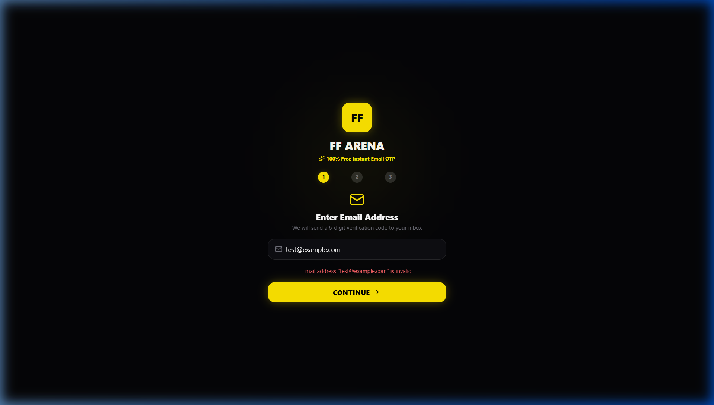

<div align="center">

# FF ARENA

### Competitive Free Fire Tournament Management Platform

[](https://github.com/mayankbohara0-dev/FF-Arena/releases)
[](https://github.com/mayankbohara0-dev/FF-Arena)
[](https://github.com/mayankbohara0-dev/FF-Arena)
[](LICENSE)



**A dark, mobile-first esports platform for discovering tournaments, joining custom rooms, tracking results, and managing payouts.**

[Download Android APK](https://github.com/mayankbohara0-dev/FF-Arena/releases/download/v1.0.0/ff-arena-v1.0.apk) · [View the repository](https://github.com/mayankbohara0-dev/FF-Arena)

</div>

---

## Overview

**FF Arena** is a tournament-management application for Free Fire community competitions. It combines a player-facing mobile experience with an administrator workspace for creating tournaments, managing room credentials, reviewing match results, and processing winner payouts.

The project is built as a web application that can also be packaged for Android with Capacitor. Its interface includes player tournament flows, wallet and payment screens, leaderboards, match-result review, and administrative governance tools.

> **Important:** FF Arena is an independent community project and is not affiliated with, endorsed by, or sponsored by Garena or Free Fire.

## Core features

### Player experience

- Browse and join Solo, Duo, and Squad tournaments.
- View maps, entry fees, player capacity, start times, and reward information.
- Track available slots and joined tournaments.
- Receive custom Room ID and Password information when a room is unlocked.
- View match receipts, results, leaderboards, and player statistics.
- Report match issues with a timestamp and description.
- Manage a player profile and wallet balance.

### Tournament operations

- Create and publish tournaments from the administrator panel.
- Support maps such as Bermuda, Kalahari, Purgatory, and Alpine.
- Manage custom-room credentials and release them to registered players.
- Track tournament occupancy and active matches.
- Export tournament rosters as CSV files for coordination and scoring.

### Results and payouts

- Review submitted scoreboard information and match results.
- Maintain winner and kill-bounty payout queues.
- Support UPI-based payout workflows for administrators.
- Provide wallet top-up and transaction-reconciliation flows.

### Governance and fair play

- Role-aware administrator workflows for tournament governance.
- Player search and management tools.
- Match review and dispute-management flows.
- Anti-fraud and fair-play review areas for suspicious activity.

## Technology stack

| Layer | Technology |
| --- | --- |
| Frontend | React 19 and TypeScript |
| Build tool | Vite 6 |
| Mobile packaging | Capacitor 8 and Android |
| Styling | Tailwind CSS 4 with a custom dark glassmorphic UI |
| Icons and interaction | Lucide React, Web Audio API, and Capacitor plugins |
| Backend services | Firebase and Supabase integrations present in the project |
| Android toolchain | Java, Gradle, and Android SDK |

## Project structure

```text
FF-Arena/
├── android/                 # Native Android Capacitor project
├── public/                  # Logos, favicon, PWA files, and APK assets
├── src/
│   ├── components/          # Player, admin, landing, and shared UI
│   ├── context/             # Application-wide state management
│   ├── services/            # Authentication, sound, anti-fraud, and data services
│   ├── supabase/            # Supabase client and authentication helpers
│   ├── types/               # Domain types and interfaces
│   ├── App.tsx              # Main application entry and routing
│   ├── index.css            # Global styles, tokens, and animations
│   └── main.tsx             # React mount and PWA initialization
├── supabase/                # Database schema, policies, seed, and storage SQL
├── capacitor.config.ts      # Capacitor configuration
├── package.json             # Scripts and dependencies
├── vite.config.ts           # Vite configuration
└── README.md                # Project documentation
```

## Getting started

### Prerequisites

Install **Node.js 18 or later** and npm. Android Studio, a compatible JDK, and the Android SDK are additionally required for native Android builds.

### Install and run locally

```bash
git clone https://github.com/mayankbohara0-dev/FF-Arena.git
cd FF-Arena
npm install
npm run dev
```

The Vite development server runs at [http://localhost:3000](http://localhost:3000).

### Configure environment variables

Copy the example environment file and replace the placeholder values with credentials from the Firebase project used for local development.

```bash
cp .env.example .env
```

Expected variables:

```env
VITE_FIREBASE_API_KEY=your-api-key-here
VITE_FIREBASE_AUTH_DOMAIN=your-project.firebaseapp.com
VITE_FIREBASE_PROJECT_ID=your-project-id
VITE_FIREBASE_STORAGE_BUCKET=your-project.appspot.com
VITE_FIREBASE_MESSAGING_SENDER_ID=your-sender-id
VITE_FIREBASE_APP_ID=your-app-id
VITE_FIREBASE_MEASUREMENT_ID=your-measurement-id
```

Do not commit real credentials or production secrets to the repository.

## Available scripts

| Command | Purpose |
| --- | --- |
| `npm run dev` | Start the Vite development server on port 3000 |
| `npm run build` | Type-check and build the production web bundle |
| `npm run preview` | Preview the production bundle locally |
| `npm run cap:build` | Build the web bundle and synchronize it to Android |
| `npm run cap:sync` | Synchronize web assets and plugins with Android |
| `npm run cap:open` | Open the Android project in Android Studio |

## Android build

Build and synchronize the web application first:

```bash
npm run cap:build
```

Then open the native project in Android Studio:

```bash
npx cap open android
```

Alternatively, build a debug APK from the `android` directory using the Gradle wrapper:

```bash
cd android
./gradlew assembleDebug
```

On Windows, use `gradlew.bat assembleDebug`. The generated debug APK is typically placed at:

```text
android/app/build/outputs/apk/debug/app-debug.apk
```

## Data and security notes

The repository includes SQL files for database schema, row-level-security policies, seed data, and storage setup under `supabase/`. Review and configure these policies before connecting the application to a production backend. Administrator credentials, payout actions, room credentials, and player data should be protected with production-grade authentication and authorization controls.

Financial, tournament, and anti-fraud behavior should be validated for the intended jurisdiction and operating model before public deployment. This README describes the application’s documented workflows; it does not constitute legal, financial, or regulatory advice.

## Contributing

Contributions are welcome. Create a feature branch, make focused changes, run the production build, and open a pull request with a clear description of the change.

```bash
git checkout -b feature/your-change
npm install
npm run build
git add .
git commit -m "Describe your change"
git push origin feature/your-change
```

## License

This project is released under the [MIT License](LICENSE).

<div align="center">

**Built for community esports organizers and Free Fire players.**

</div>
